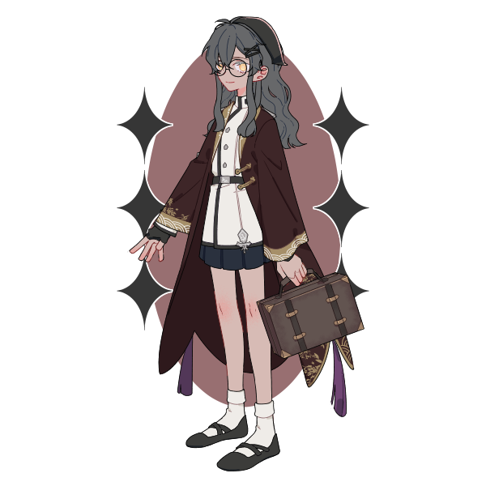
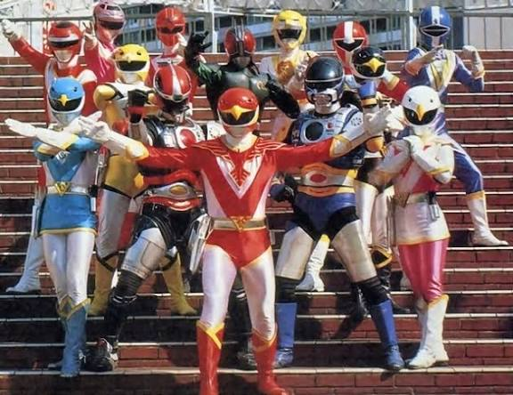
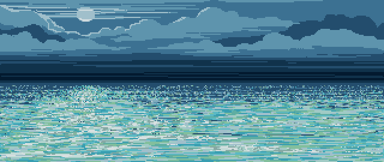

<!DOCTYPE html>
<html lang="pt-BR">
<head>
<meta charset="UTF-8">
<title>Feliz Aniversário Vivian!</title>

</head>

<body>

 

  
 

 

  <button onclick="document.getElementById('mensagem').innerHTML='feliz aniversário minha amiga amadaaaaaaa!!!!!!'">VIVIAN</button>
  <button onclick="document.getElementById('mensagem').innerHTML='achou que eu tinha esquecido né?'">vivian</button>
 

 

 

 

 <!-- incluir vídeo -->

</body>
</html>
